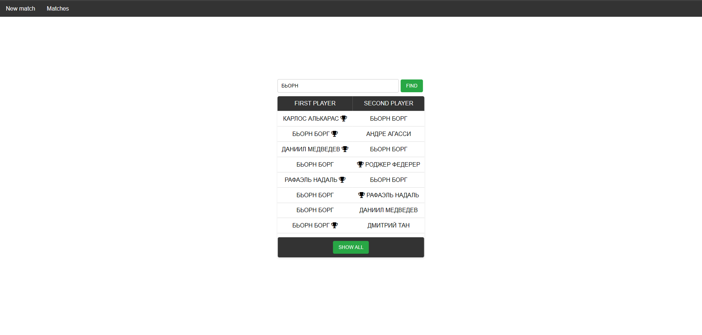

<h1 align='center'>
Tennis score board project
</h1>

## Overview

This project is a web application for maintaining and 
displaying the current results of a tennis match in real time. 
The main goal of the project is to automate the scoring process.

Main functions:
* Current score tracking — displays the current scores of each player in games, sets 
according to the rules of tennis.
* Match Data Storage — saves data on completed matches for match history.

## Technologies / tools used:

- Jakarta servlets;
- Java Server Pages (JSP);
- HTML, CSS;
- Hibernate ORM;
- H2 in-memory database;
- Tomcat 10;
- JUnit 5;
- Jackson JSON;
- Maven.

## Database

#### Table `Players`

<table>
    <tr>
        <th>Column</th>
        <th>Type</th>
        <th>Description</th>
    </tr>
    <tr>
        <td>ID</td>
        <td>Int</td>
        <td>Auto Increment, Primary Key</td>
    </tr>
    <tr>
        <td>Name</td>
        <td>Varchar</td>
        <td>Full name of player, Unique</td>
    </tr>
</table>

#### Table `Matches`
<table>
    <tr>
        <th>Column</th>
        <th>Type</th>
        <th>Description</th>
    </tr>
    <tr>
        <td>ID</td>
        <td>Int</td>
        <td>Auto Increment, Primary Key</td>
    </tr>
    <tr>
        <td>Player1</td>
        <td>Int</td>
        <td>First player id, References to Players.ID</td>
    </tr>
    <tr>
        <td>Player2</td>
        <td>Int</td>
        <td>Second player id, References to Players.ID</td>
    </tr>
    <tr>
        <td>Winner</td>
        <td>Int</td>
        <td>Winner id, References to Players.ID</td>
    </tr>
</table>

## Screenshots

<figure style="text-align: center;">
  
  <figcaption>Main menu</figcaption>
</figure>
 
<figure style="text-align: center;">
  
  <figcaption>Current match score</figcaption>
</figure>
 
<figure style="text-align: center;">
  
  <figcaption>Current match results</figcaption>
</figure>
 
<figure style="text-align: center;">
  
  <figcaption>Page of all matches</figcaption>
</figure>
 
<figure style="text-align: center;">
  
  <figcaption>All matches of a specific player</figcaption>
</figure>

## What did I learn from this project?
- creating simple web applications using Java EE (Servlets, JSP);
- designing user interface using CSS;
- testing the project with JUnit;
- work with Hibernate to interact with the database.